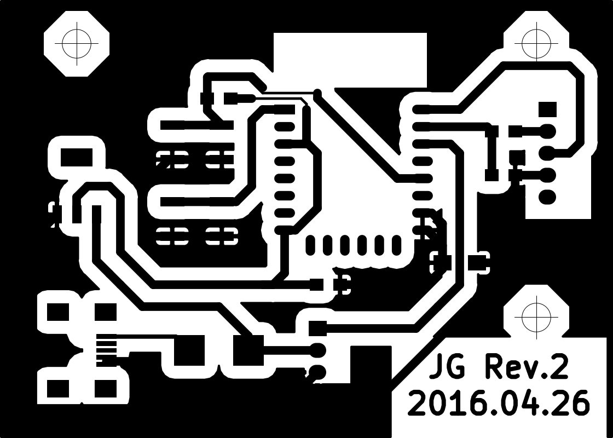

The printed circuit board (PCB) layout for use in the Light Alarm Clock Project. 

This includes the copper traces, solder mask, and silk screen layers, in addition to component selection and layout.

3D Render
 
Schematic

Front Copper layer

# Firmware
The corresponding firmware can be found [here](https://github.com/JonGroves/ESP8266_LightAlarmClock).
